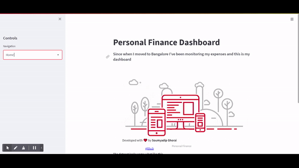

# Personal Finance : 

Every night I used to fill the data in an Excel sheet. And this is my personal finance dashboard where I have plotted various charts representing my spendings.

<p align = 'center' >
    
</p>

----------------------------

## Approach : 

* So Initially I have used an <code>.ipynb</code> file to do the preprocessing and do some visualization

* Then I have made another file <code>finance.py</code> to implement all the functions related to preprocessing and plotting

* I have imported the same file in <code>app.py</code> and used it along with streamlit to build the app.

------------------------------

## Features : 

* Shows multiple analytical charts to help me better understand my spendings.
* Can be connected to the database and automated. 
* Answers few predefined quick QNA type questions. 
* Responsive layout, can be opened in any device. 

------------------------------

## How to run? 

> To run the app you need to download this repository along with the required libraries and it the command line you have to write <code>streamlit run app.py</code> to run. 

> it might ask for your email once...

------------------------------- 

## Document Structure 

```
Personal Finance 
│
|---- __pycache__
|
|---- .streamlit
|   |---- config.toml
|
|---- data 
|   |---- bangalore - item.csv
|   |---- bangalore - Total_spending.csv
|
|---- demo 
|   |---- __pycache__
|   |---- data
|   |   |---- bangalore - item.csv
|   |   |---- bangalore - Total_spending.csv
|   |
|   |---- demoapp.py
|   |---- democalss.py
|   |---- README.md
|   
|---- results
|   |---- Personal Finance.mp4
|   |---- Screenshot.png
|
|---- static
|   |---- compressed_heroimage.gif
|   |---- hero_image.gif
|
|---- app.py
|---- exploratory_data_analysis.ipynb
|---- finance.py
|---- markdown.py
|---- Procfile 
|---- README.md
|---- requirements.txt
|---- setup.sh

```
---------------------


## Technologies used : 

* python library - numpy, pandas, seaborn, matplotlib, streamlit
* version control - git 
* backend - streamlit
* concept - OOP

## Tools and Services : 
* IDE - Vs code 
* Application Deployment - Heroku
* Code Repository - GitHub

-----------------------
<br>

